## How to compile
```
make aie
make hls
make xsa
make host
make package
```

## Analysis of Parallelism
| 1-parallelism | 2-parallelism |
| :---: | :---: |
| Time requirement: 90265 us | Time requirement: 70527 us |
| 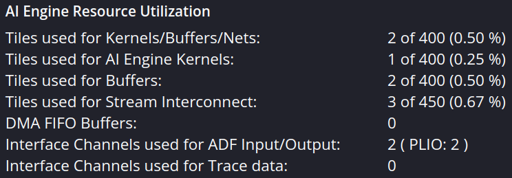 | 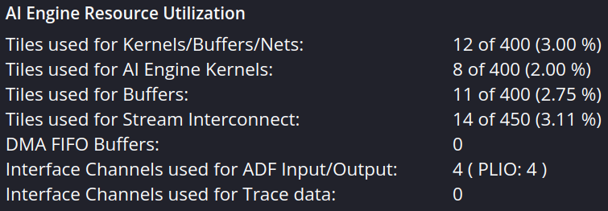 | 
| 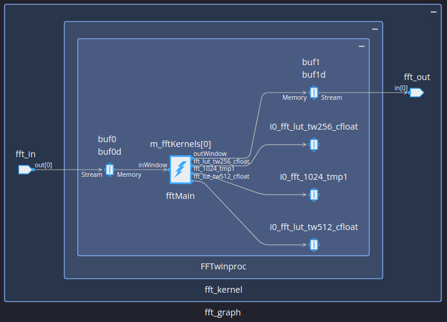 | 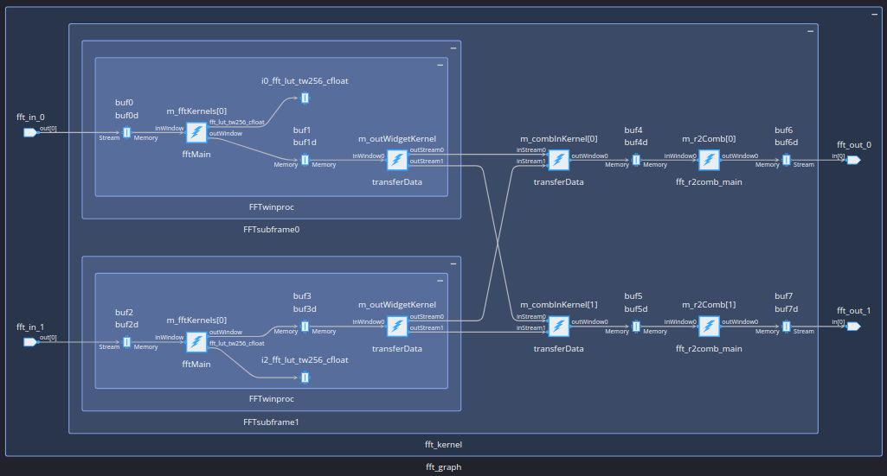 | 
| 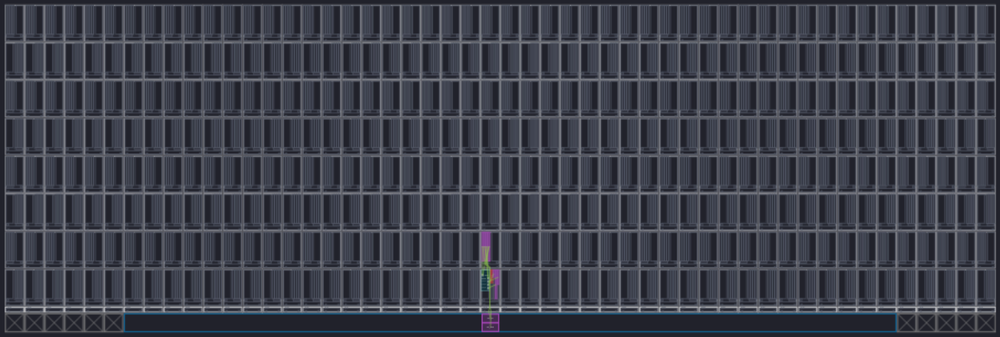 | 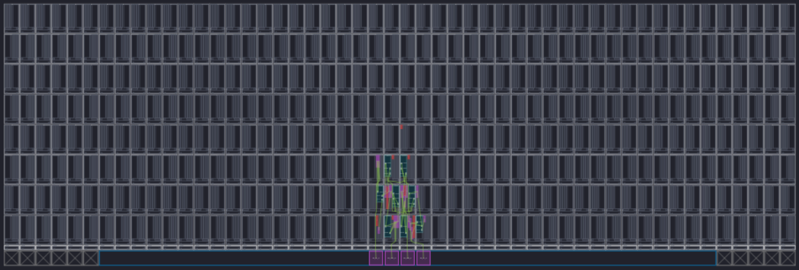 | 
| 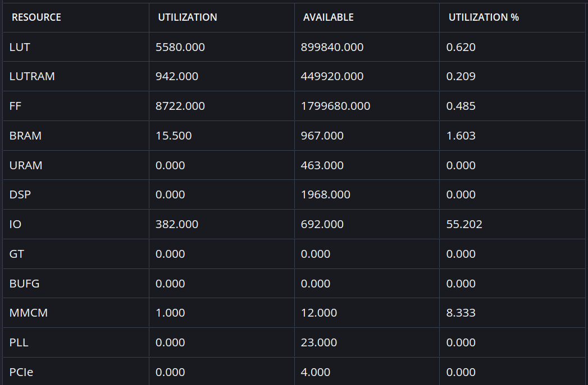 | 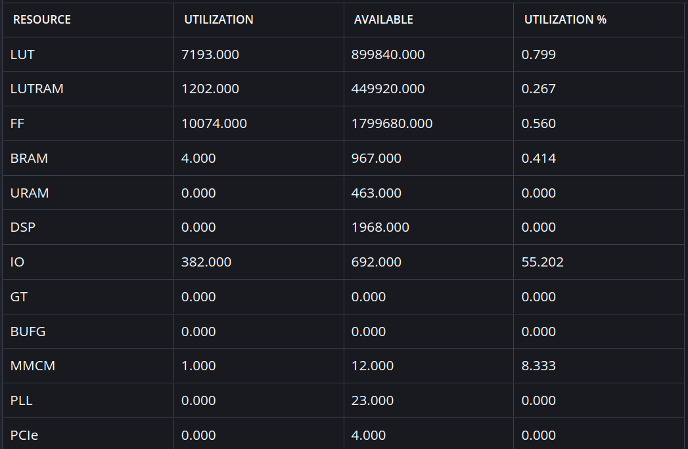 | 
* Time requirement of 1-parallelism: (92307+91215+94674+92912+90864+94735+78237+88278+84813+94617)/10=90265.2 us 
* Time requirement of 2-parallelism: (72680+72702+78955+52469+74924+71306+52863+79045+66018+84310)/10=70527.2 us

## Analysis of Distribution
* TP_WINDOW_VSIZE = 1024 * 2
* Distribute the stream to 2 FFT kernels
* Time requirement: (30699+27543+30708+30437+29609+29585+30782+27020+27162+25551)/10 = 28909.6 us
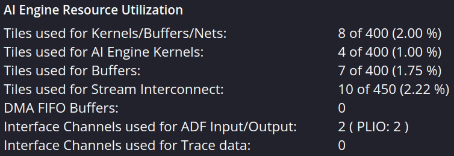
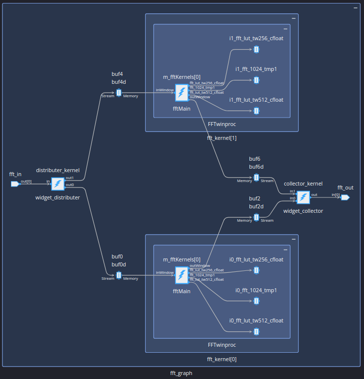
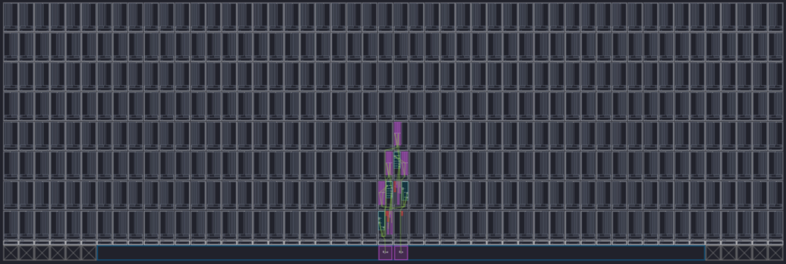