## How to compile
```
make aie
make hls
make xsa
make host
make package
```

## Analysis of Parallelism
| 1-parallelism | 2-parallelism |
| :---: | :---: |
| Time requirement: 90265 us | Time requirement: 70527 us |
| 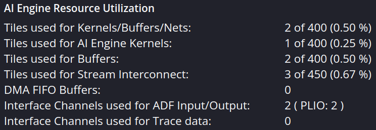 |  | 
| 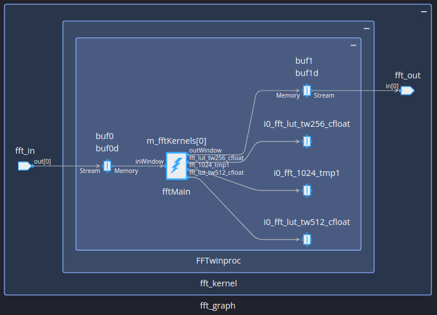 | 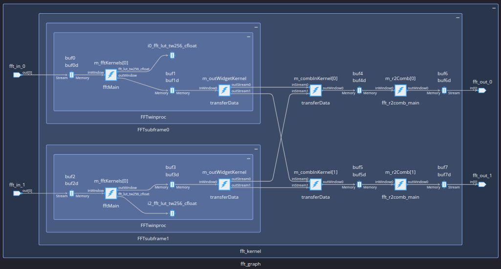 | 
| 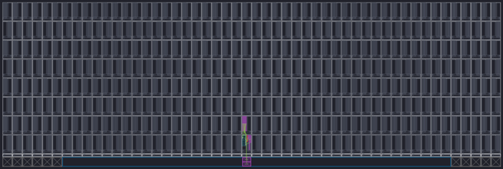 | 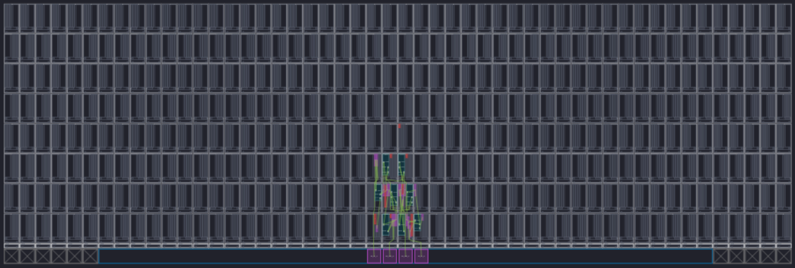 | 
| 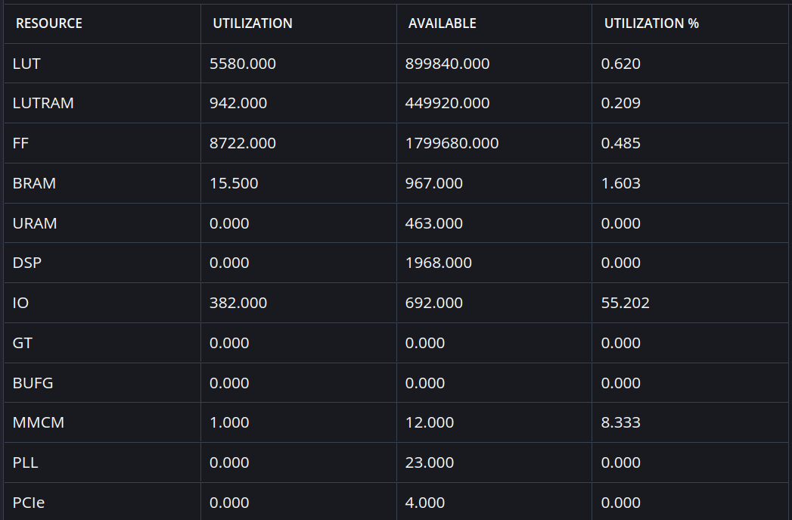 | 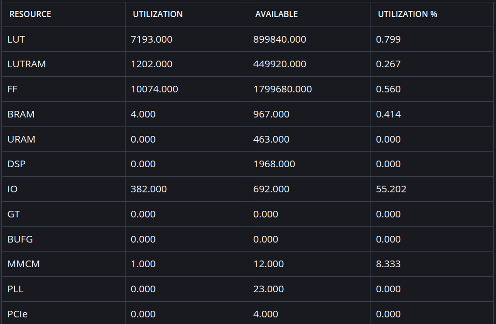 | 
* Time requirement of 1-parallelism: (92307+91215+94674+92912+90864+94735+78237+88278+84813+94617)/10=90265.2 us 
* Time requirement of 2-parallelism: (72680+72702+78955+52469+74924+71306+52863+79045+66018+84310)/10=70527.2 us

## Analysis of Distribution
* `TP_WINDOW_VSIZE`: 1024 x 2

| 2 kernels | 4 kernels |
| :---: | :---: |
| Time requirement: 28910 us | Time requirement: 17839 us |
| 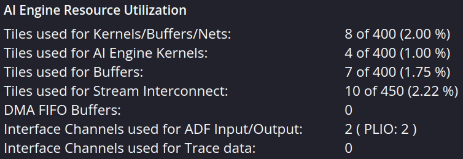 | 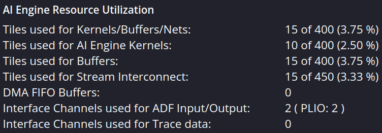 |
| 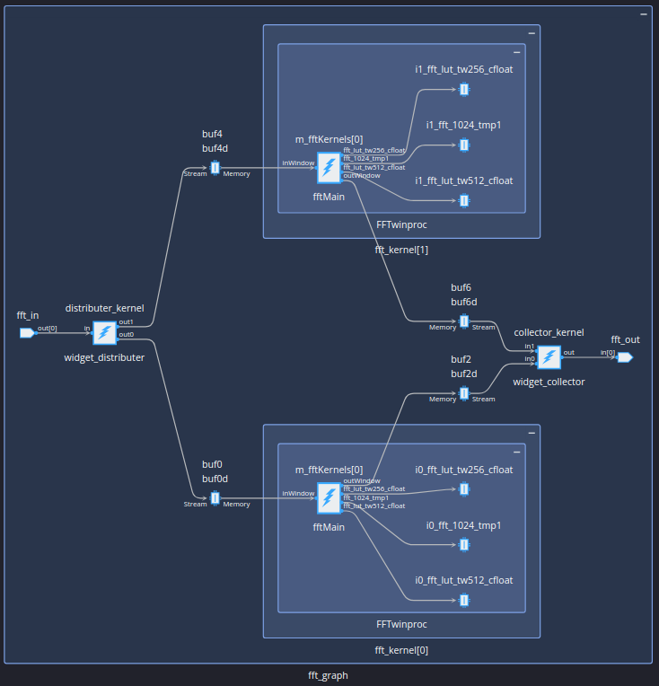 | 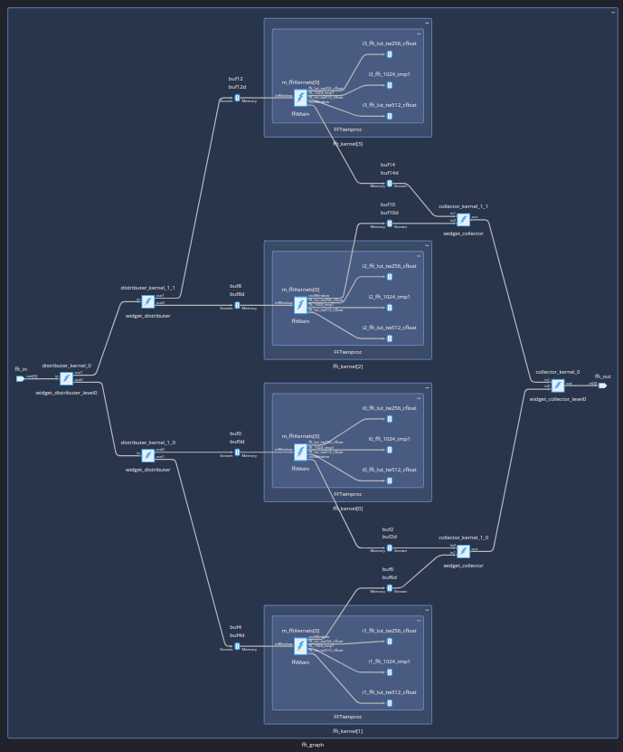 |
| 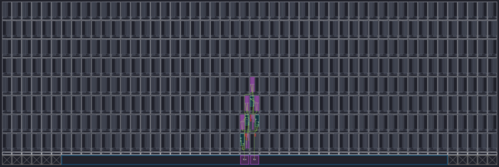 | 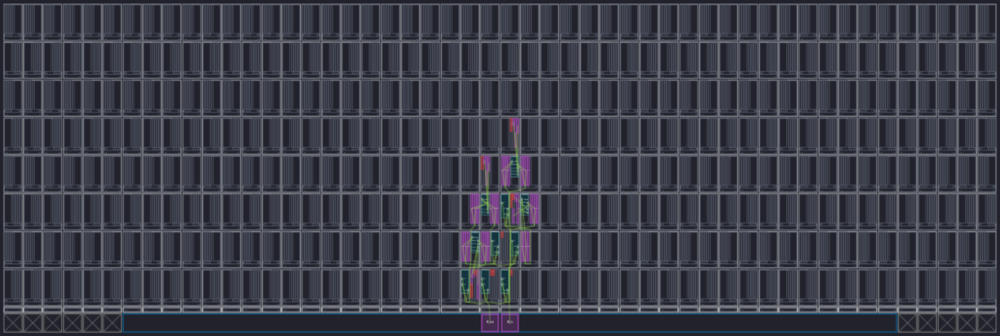 |
* Time requirement of 2 kernels: (30699+27543+30708+30437+29609+29585+30782+27020+27162+25551)/10 = 28909.6 us
* Time requirement of 4 kernels: (18104+18672+16816+18693+17410+16946+16979+17149+18699+18923)=17839.1 us

## Analysis of Mapper/Router
* 4-kernels, 4-parallelism
### Auto-Routing
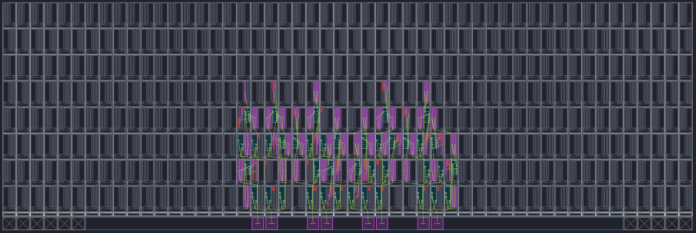
### Routing with Constraint
* 33 min for routing
* `aie_constraints.json`
```json
{
    "GlobalConstraints": {
        "areaGroup": {
            "name": "fft_graph",
            "nodeGroup": [
                "fft_graph.*"
            ],
            "tileGroup": [
                "(22,0):(22,7)",
                "(23,0):(23,7)",
                "(24,0):(24,7)",
                "(25,0):(25,7)",
                "(26,0):(26,7)",
                "(27,0):(27,7)",
                "(28,0):(28,7)",
                "(29,0):(29,7)"
            ]
        }
    }
}
```
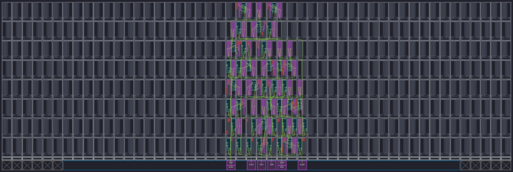