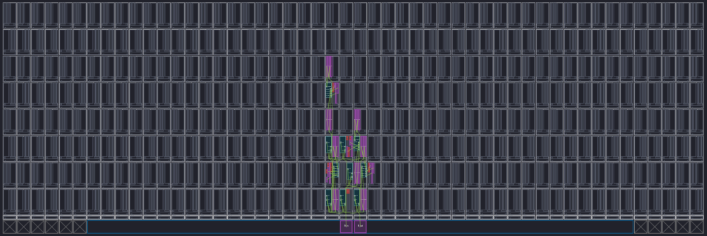

## How to compile
```
make aie
make hls
make xsa
make host
make package
```

## Analysis of Parallelism
* PLIO is used

| 1-parallelism | 2-parallelism |
| :---: | :---: |
| Time requirement: 90265 us | Time requirement: 70527 us |
|  |  | 
|  |  | 
|  |  | 
|  |  | 
* Time requirement of 1-parallelism: (92307+91215+94674+92912+90864+94735+78237+88278+84813+94617)/10=90265.2 us 
* Time requirement of 2-parallelism: (72680+72702+78955+52469+74924+71306+52863+79045+66018+84310)/10=70527.2 us

## Analysis of Distribution
* `TP_WINDOW_VSIZE`: 1024 x 2
* PLIO is used

| 2 kernels | 4 kernels |
| :---: | :---: |
| Time requirement: 28910 us | Time requirement: 17839 us |
|  |  |
|  |  |
|  |  |
* Time requirement of 2 kernels: (30699+27543+30708+30437+29609+29585+30782+27020+27162+25551)/10 = 28909.6 us
* Time requirement of 4 kernels: (18104+18672+16816+18693+17410+16946+16979+17149+18699+18923)/10 = 17839.1 us

| 4 kernels | 8 kernels |
| :---: | :---: |
| Time requirement: 15947 us | Time requirement: 13116 us |
|  |  |
|  |  |
|  |  |
|  |  |
* Time requirement of 4 kernels: (15844+15811+15907+15795+15852+16384+16066+15930+15916+15967)/10 = 15947.2 us
* Time requirement of 8 kernels: (13118+13186+13100+13131+13126+13126+13145+13089+13073+13067)/10 = 13116.1 us

## Analysis of Mapper/Router
### 8-kernels
| auto-routing | constraint |
| :---: | :---: |
| Time requirement: 13116 us | Time requirement: 13325 us |
|  |  |
|  |  |
* Time requirement of 8 kernels with constraint: (13331+13345+13296+13339+13324+13355+13313+13319+13302+13330)/10 = 13325.4 us
```json
// aie_constraints.json
{
    "GlobalConstraints": {
        "areaGroup": {
            "name": "fft_graph",
            "nodeGroup": [
                "fft_graph.*"
            ],
            "tileGroup": [
                "(25,0):(25,7)",
                "(26,0):(26,7)",
                "(27,0):(27,7)"
            ]
        }
    }
}
```

## Analysis of Architecture
|  | dist. acc. method | multi-port method |
| :---: | :---: | :---: |
| block diagram |  |  |
| main difference| 1. one data mover which moves<br> four data from/to DDR and AIE<br>2. streaming operation | 1. four data movers, each moves<br> one data from/to DDR and AIE<br>2. memory based operation |
| benefit | 1. throughput is higher | 1. NOC can be used<br>2. AIE utilization is lower  |
| drawback | 1. NOC can <u>not</u> be used<br>2. AIE utilization is higher | 1. throughput is slower<br>(use PL may be faster)<br>2. NOC utilization is higher |
| time requirement for 1024 times of 1024-FFT | 15985 us | 16512 us|
| AIE utilization|  |  |
| graph |  |  |
| array |  |  |
* Distrubution: (16096+15945+15962+15901+16032+15994+16012+15957+15980+15969) = 15984.8 us
* Direct parallelism: (16458+16390+16387+16353+16679+16458+16515+16515+16886+16477)/10 = 16511.8 us
```json
// aie_constraints.json
{
    "GlobalConstraints": {
        "areaGroup": {
            "name": "fft_graph",
            "nodeGroup": [
                "fft_graph.*"
            ],
            "tileGroup": [
                "(25,0):(25,7)",
                "(26,0):(26,7)"
            ]
        }
    }
}
```

## Analysis of Power Consumption
### 8-kernels


### 
* Power consumption of data mover in AIE
    * AXI stream > cascade stream > DMA